Unofficial KV331 Synthmaster 3 user manual

- [About this manual](#about-this-manual)
- [Mouse Controls \& Interactions](#mouse-controls--interactions)
  - [Keyboard Shortcuts](#keyboard-shortcuts)
  - [Workflow Specific Controls](#workflow-specific-controls)
- [User interface overview](#user-interface-overview)
  - [Header](#header)
  - [Tab View](#tab-view)
  - [Track view](#track-view)
  - [Mix View](#mix-view)
  - [Info view](#info-view)
  - [Shop view](#shop-view)
  - [Browser view](#browser-view)
  - [Mod matrix panel](#mod-matrix-panel)
  - [Keyboard interface and Settings](#keyboard-interface-and-settings)
- [Tab view in-depth](#tab-view-in-depth)
  - [Layers](#layers)
  - [Oscillators](#oscillators)
    - [Basic oscillator](#basic-oscillator)
      - [Core Controls \& Waveform Shaping](#core-controls--waveform-shaping)
  - [Pitch \& Movement](#pitch--movement)
  - [Oscillator \& Voice Tabs](#oscillator--voice-tabs)
    - [Granular oscillator](#granular-oscillator)
    - [Core Granular Oscillator Parameters](#core-granular-oscillator-parameters)
    - [Additive oscillator](#additive-oscillator)
    - [Vector oscillator](#vector-oscillator)
    - [Wavetable oscillator](#wavetable-oscillator)
    - [VAnalog oscillator](#vanalog-oscillator)
  - [Filters/Waveshapers](#filterswaveshapers)
    - [Digital filter](#digital-filter)
    - [VAnalog filter](#vanalog-filter)
    - [Ladder filter](#ladder-filter)
    - [Diode Ladder filter](#diode-ladder-filter)
    - [State variable filter](#state-variable-filter)
    - [Bite filter](#bite-filter)
    - [Comb filter](#comb-filter)
    - [Formant filter](#formant-filter)
    - [Phaser filter](#phaser-filter)
    - [Waveshaper](#waveshaper)
    - [Operator (appears broken)](#operator-appears-broken)
  - [Modulation](#modulation)
    - [ADSR Envelope Parameters](#adsr-envelope-parameters)
    - [Multistage Envelope Parameters](#multistage-envelope-parameters)
    - [LFO (Low Frequency Oscillators) parameters](#lfo-low-frequency-oscillators-parameters)
    - [Noise LFO](#noise-lfo)
    - [Step LFO](#step-lfo)
    - [Scaler](#scaler)
  - [Layer tab](#layer-tab)
  - [Routing](#routing)
  - [Layer FX Tab](#layer-fx-tab)
    - [1. Insert Effect Modules (Per-Layer)](#1-insert-effect-modules-per-layer)
    - [2. Layer FX Controls](#2-layer-fx-controls)
  - [SEQ Tab](#seq-tab)
  - [Arp tab](#arp-tab)
- [Track view in-depth](#track-view-in-depth)
- [Mix view in-depth](#mix-view-in-depth)
- [Keyboard and interface settings in-depth](#keyboard-and-interface-settings-in-depth)
  - [Keyboard](#keyboard)
  - [XY Pad](#xy-pad)
  - [FX Bus](#fx-bus)
  - [Settings](#settings)

## About this manual

There are videos on the synthesizer, but a need for manual on paper was needed to serve as a reference point where watching is not possible. Structuring this guide provides concise and logical details about each aspect of the synth, and goes into as much detail as possible. If there is anything missing, please feel free to let me know.

## Mouse Controls & Interactions

- **Parameter Adjustment:** Click and drag knobs/sliders. Double-clicking modulation sources allows renaming.
- **Mouse Wheel:** Adjusts discrete values, scrolls through lists, and reverses behavior in settings.
- **Scroll Wheel + Shift:** Zooms in/out of the sequencer and scrolls horizontally/vertically.
- **Modulation Routing:** Drag and drop modulation sources onto targets.
- **Preset Preview:** Move the mouse over the "Play" icon next to a preset name, or hold Shift + move the mouse wheel over a preset.
- **Browser Navigation:** Click columns to focus (outlined in yellow), allowing mouse wheel browsing.
- **Layer View Switching:** Shift-click layer buttons to switch to a specific view (Layer, Track, Mix) for all layers simultaneously.
- **Wavetable/Sample Import:** Drag and drop WAV/AIF files directly onto the wavetable display.
- **UI Scaling:** Click and drag the corner of the skin to adjust size.

### Keyboard Shortcuts

- **Preset Navigation:** Use **Arrow Keys** to navigate through presets when the browser is focused.
- **Column Navigation:** Use **Tab** to move to the next column and **Shift+Tab** for the previous column.
- **Preview Preset:** Use **Shift + Up/Down Arrows** to preview sounds without loading.
- **Built-in Keyboard:** A PC/Mac keyboard can be activated to play notes.
- **Octave Control:** Change the starting octave using the mouse on the keyboard interface.
- **Undo/Redo:** Available for recent parameter edits.

### Workflow Specific Controls

- **Sequencer:** Steps can be edited with the mouse, notes changed via the mouse wheel, and patterns randomized.
- **Modulation Matrix:** Modulated parameters are highlighted for easy identification.
- **Layer Controls:** Dedicated buttons for muting, soloing, and enabling layers.
- **NKS Support:** Presets can be previewed without loading if NKS data is present.

## User interface overview

### Header

From left to right:

- Switch between Tab view, Track view, Mix view, Info view which shows current preset metadata, Shop and Preset Browser
- Undo/Redo button
- Preset display with left and right arrows to navigate presets quickly. Right-click for context menu to load/download extra presets, sync with the Cloud, or start with an init patch
- RNDM chooses random preset and Save saves the current preset
- Master volume with Normalize button and Boost volume option to increase global loudness

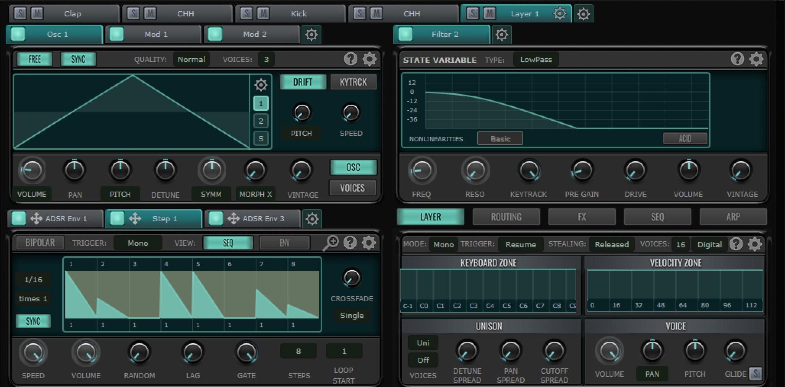

### Tab View

The default workspace where you can manage layers, oscillators, modulators, filters, and effects as horizontal tabs.

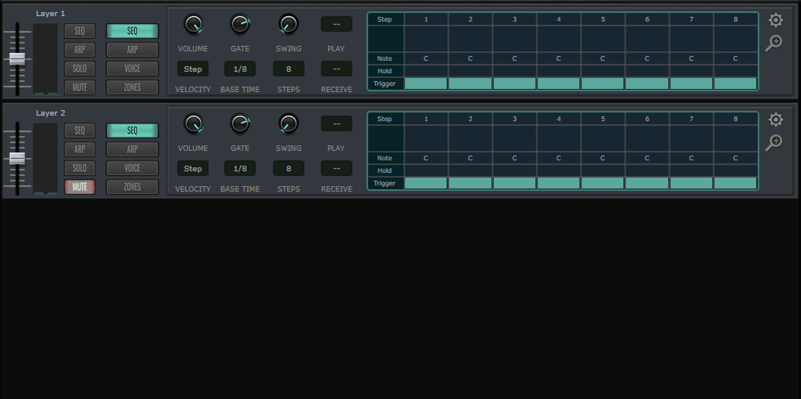

### Track view

Displays layers in a list format, allowing for quick adjustments across multiple tracks. Features include **solo/mute controls**, sequencer/arpeggiator toggling, and deep editing of parameters via zoomable popups

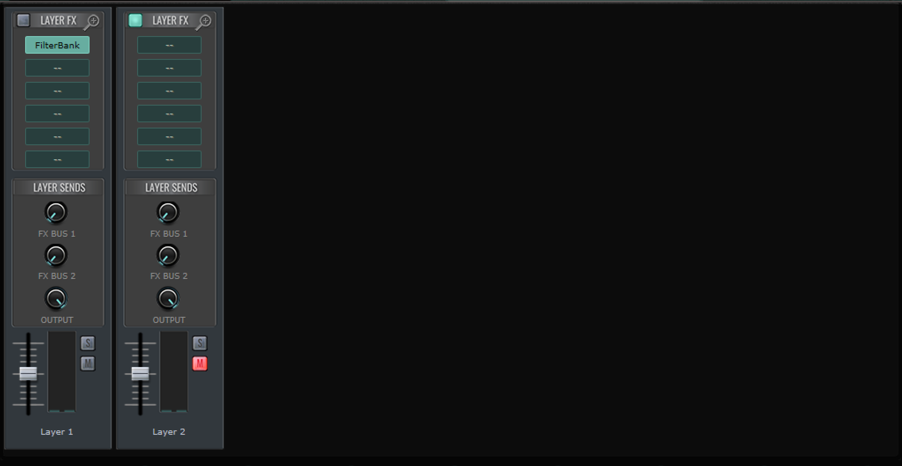

### Mix View

A vertical layout designed for mixing, featuring insert effects per layer and **Global Effects Buses** for routing and send amount control.

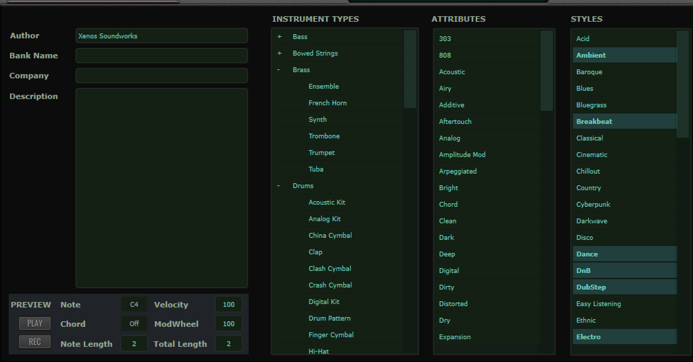

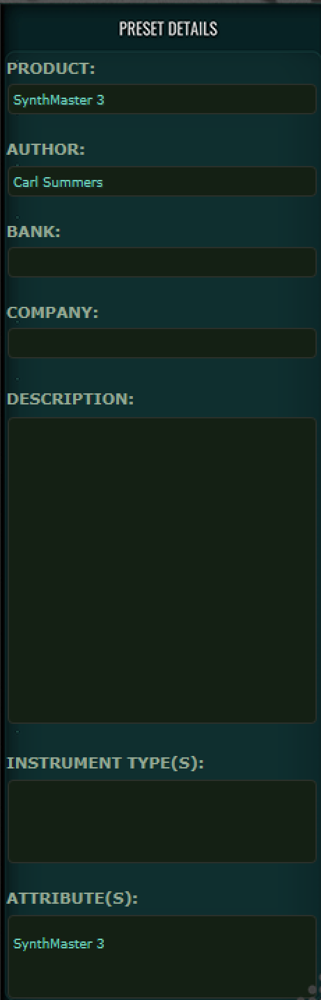

### Info view

Displays metadata about the preset. Allows users to customize preset info, including author, categories, attributes, and styles, which can then be saved directly to the system. The preset details on the right hand side is shared with the Browser view

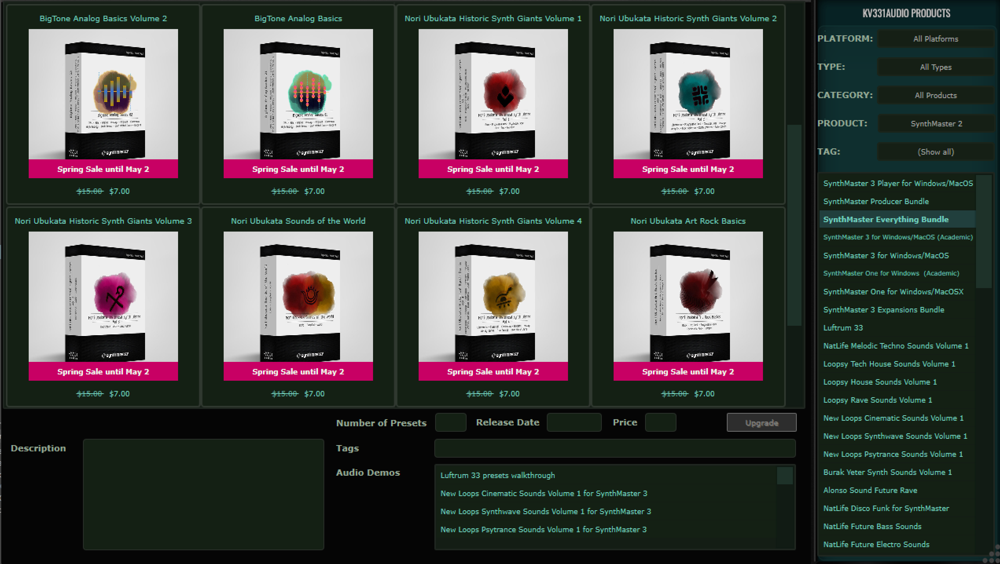

### Shop view

Displays shop item details including the thumbnails, description, number of presets, tags, link to audio demos. Top far right displays shop browsing filters, and below it is the list of shop items in list format.

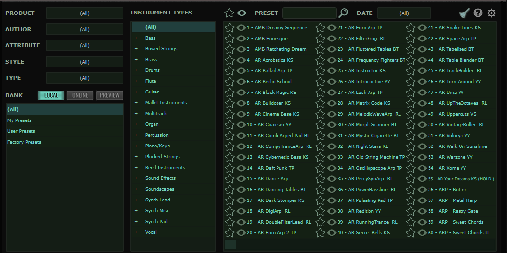

### Browser view

Offers advanced filtering by product (SynthMaster 1/2/3), author, attribute, style and type. Select between banks and preview unpurchased ones. The browser view features an integrated **audio preview** function that plays the sound when hovering over the play icon, search by name or date of preset creation.

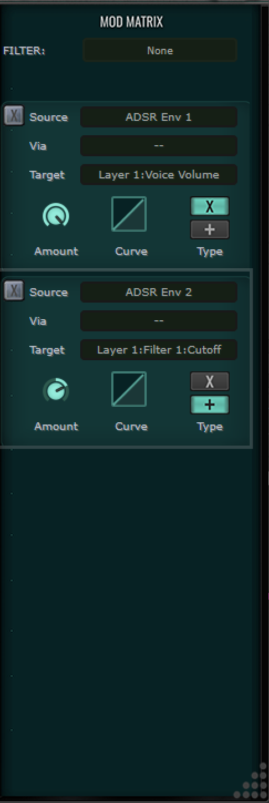

### Mod matrix panel

Shows list of active modulation assigned parameters with their source/destination, along with amount and curve options

### Keyboard interface and Settings

Section broken up into four main tabs: keyboard, XY-Pad, FX Bus and Settings.

---

## Tab view in-depth

### Layers

- Can add up to sixteen (16) layers. Add, duplicate and remove layer by clicking on cogwheel to the right of the layer tabs.
- Click on Solo (S) to solo a layer, Mute (M) to mute a layer. Double-click it to rename.
- Active layers will display their own cogwheel. Clicking it will display a context menu
  - Copy layer will let you copy the current layer
  - Reset Values+Modulation removes any changes made to the layer and returns it to the defaults
  - Save Preset saves the individual layer as a Partial Preset, which can be recalled later and used in combination with other layers from other presets
  - Tutorial videos links to Youtube video on how to use layers in Synthmaster 3 (broken)

### Oscillators

- Within each layer, you can create up to 15 oscillators
- Enable and disable each oscillator with the LED to the left of the oscillator tab
- You can add, duplicate and delete oscillators using the cogwheel next to the oscillator tabs
- Each oscillator tab can be renamed by double-clicking the tab text
- You can search for an oscillator with the magnifying glass icon next to the cogwheel
- Use the left and right arrows next to the magnifying glass to navigate between oscillator tabs in the list
- The various kinds of oscillators are:
  - Basic
  - Granular
  - Additive
  - Vector
  - Wavetable
  - VAnalog

The various oscillator types allow for Free and Sync options to be enabled

- **"Free" button enables a free-running mode, causing the waveform phase to constantly advance rather than resetting to a fixed point every time a key is pressed**
- Sync performs hard oscillator sync, where a secondary oscillator's waveform phase is reset to zero whenever a primary oscillator completes a cycle**

Each oscillator type also has a help and options menu. Help (marked by the question mark) opens context leading to video documentation how to use oscillator. The cogwheel opens a context menu to:

- copy the layer
- reset value/values and modulation
- lock the oscillator within the layer
- replace the current oscillator with another type
- Save partial preset of oscillator which saves the custom adjustments that can be recalled later

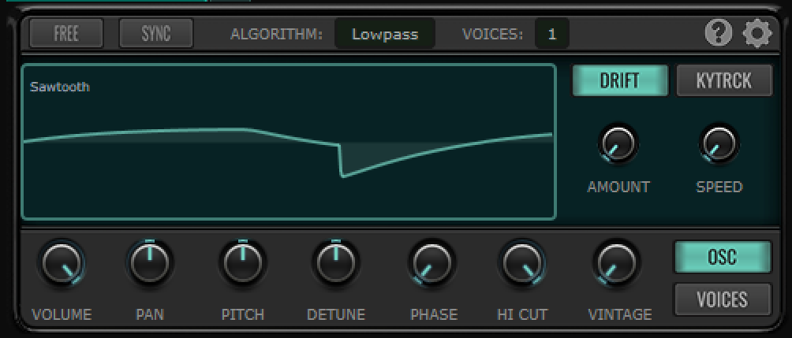

#### Basic oscillator

Primary generator module for standard waveforms, noise, and single-cycle samples. It features a modular control set divided into core waveform shaping, performance drift, and voice-level settings.

##### Core Controls & Waveform Shaping

- **Waveform Selection**: Choose from sine, triangle, square, saw, pulse, or various noise types (white, pink, brown, blue, violet).
- **Algorithm Parameter**: Acts as a "shaping mode" that alters the waveform's fundamental character. Clicking it reveals categories like **Spectrum** (Lowpass, Highpass), **Bend**, **Pulse**, **Sync**, and **Quantize**.
- **Phase**: Sets the starting point of the waveform cycle.
- **High Cut**: A steep spectral filter used to remove upper harmonics, depending on the selected algorithm.
- **Free Button**: When active, the oscillator's phase runs freely or starts at a random value to emulate analog behavior.
- **Waveform Editor**: Accessible via a pen icon, this full editor allows you to draw or edit custom single-cycle waveforms.

#### Pitch & Movement

- **Pitch & Detune**: Standard coarse pitch (semitones/octaves) and fine-tuning (D2 knob, +/- 50 cents).
- **Drift**: Simulates vintage analog instability with two sub-parameters:
  - **Amount**: The intensity of the pitch variation.
  - **Speed**: The frequency/rate of the drift.
- **Keytracking (Kytrck)**: Modulates parameters like pitch or spectral shape based on the MIDI note played.
  - **Amount**: Determines the depth of the tracking effect.
  - **Base Note**: Sets the reference pitch for tracking.

#### Oscillator & Voice Tabs

The right-hand panel provides deeper per-oscillator and per-voice control:

| **Tab** | **Parameters** | **Description** |
| --- | --- | --- |
| **OSC** | Volume, Pan, Pitch, Detune, Phase, Hi Cut, Vintage | Controls the basic output, including a **Vintage** knob for adding subtle per-voice irregularities. |
| **Voices** | Mix, Pan Spread, Detune Spread, Phase Spread, Tone Spread | Manages unison behavior for up to 16 voices. Includes new parameters like **Mix Type** for setting unison chords or octaves. |

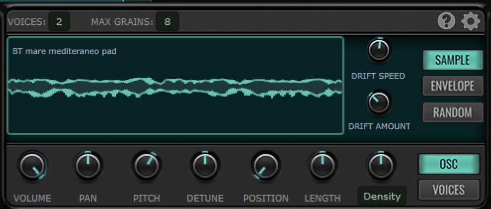

#### Granular oscillator

The granular oscillator in SynthMaster 3 is a powerful, sample-based engine allowing up to 16 voices and 32 grains per voice (512 total). Key parameters include **sample selection, position, grain length, and density, along with spread/randomization controls for pitch, volume, pan, and playback direction** to create complex, evolving textures.

#### Core Granular Oscillator Parameters

- **Sample Selection:** Ability to choose audio samples, multisamples, or wavetables as the source for granular synthesis.
- **Voice Management:** Features up to 16 voices, each capable of generating up to 32 grains.
- **Spread Parameters:** Dedicated spread controls for various parameters allowing each of the 16 voices to have different settings:
  - **Position:** The location within the sample from which grains are taken.
  - **Grain Length:** Controls the duration of individual grains.
  - **Volume & Pan:** Controls for spatial placement and loudness.
  - **Detune:** Pitch spread across the voices.
  - **Grain Start Time:** Offsets the start of grain playback.
- **Randomization (Grain Level):** Each grain can have independent randomization applied to:
  - Position and Start Time.
  - Length.
  - Playback Direction.
  - Volume, Pan, and Detune.
- **Unison:** Features, including mix type, mix curve, and pan curve.
- **Basic Controls:** Coarse/fine pitch tuning, volume, and panning

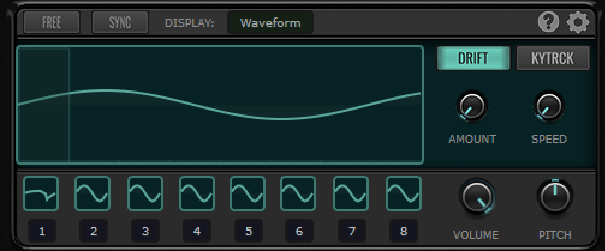

#### Additive oscillator

The **Additive Oscillator** operates as a powerful stack of **8 sub-oscillators** (effectively 8 "basic" oscillators) that run together to create complex harmonic structures. For each of the 8 sub-oscillators, you can independently control the following parameters:

**Per-Oscillator Parameters**

- **Volume**: Sets the loudness of the individual sub-oscillator.
- **Panning**: Positions the individual sub-oscillator in the stereo field.
- **Pitch/Frequency**: Adjusts the specific frequency or pitch of each partial.
- **Detune**: Fine-tunes the pitch for thicker, chorus-like additive textures.
- **Phase/Pulse Width**: Controls the starting phase of the waveform or its pulse width.
- **Waveform Type**: Unlike traditional additive synths limited to sine waves, each of the 8 oscillators can use any standard waveform or single-cycle shape.
- **Tone**: Adjusts the spectral brightness or character of the individual sub-oscillator.

**Global & Unison Parameters**

Like the other oscillator types in SynthMaster 3, the Additive Oscillator also benefits from the expanded **Voices** tab for unison effects:

- **Voices**: Supports up to **16 unison voices**.
- **Mix Type**: A new parameter in version 3 that allows you to select specific chords or octaves for the unison voices.
- **Spread Parameters**: Includes **Pan Spread**, **Detune Spread**, **Phase Spread**, and **Tone Spread** to create wide, evolving sounds.
- **Vintage Knob**: Adds subtle, per-voice irregularities to simulate the character of analog hardware.

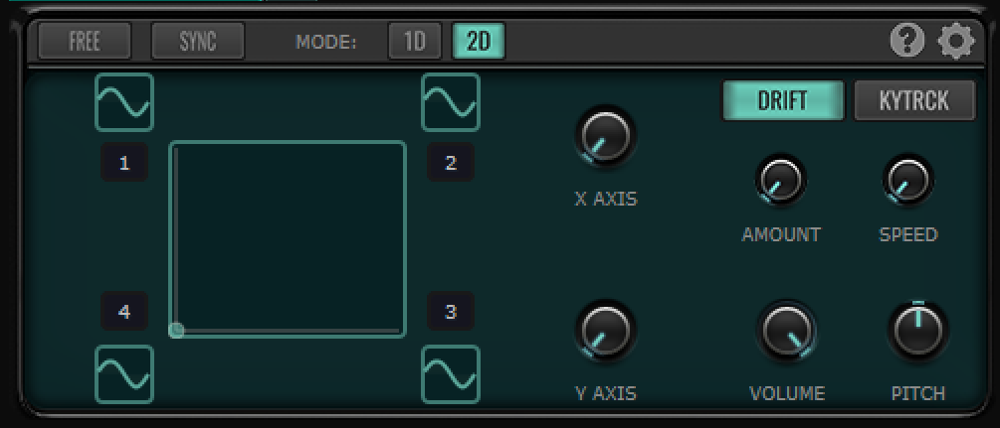

#### Vector oscillator

The **Vector Oscillator** in SynthMaster 3 consists of **4 sub-oscillators (A, B, C, and D)** whose outputs are mixed using a 2D XY pad. This allows for complex, evolving textures by blending four different sound sources.

Here are the primary parameters for the Vector Oscillator:

**XY Vector Pad**

- **X/Y Position**: Determines the mix balance between the four oscillators.
  - Top Left = Oscillator A
  - Top Right = Oscillator B
  - Bottom Left = Oscillator C
  - Bottom Right = Oscillator D
- **Vector Recording**: Allows you to record and playback XY movements.

**Sub-Oscillator Controls (A, B, C, D)**

Each of the four sources has its own set of "Basic Oscillator" style controls:

- **Waveform Selection**: Choose standard shapes, noise, or custom single-cycle waveforms.
- **Algorithm**: Apply shaping modes (Sync, Bend, Pulse, etc.) per sub-oscillator.
- **Volume & Pan**: Individual gain and stereo positioning for each source.
- **Pitch & Detune**: Independent tuning for each of the four corners.
- **Phase**: Adjusts the starting point of the waveform cycle.

**Global & Voice Parameters**

- **Drift**: Controls the **Amount** and **Speed** of pitch instability across the entire oscillator.
- **Keytracking (Kytrck)**: Adjusts how parameters track the keyboard based on a **Base Note**.
- **OSC Tab**: Provides global Volume, Pan, and the **Vintage** knob for analog character.
- **Voices Tab**: Controls unison (up to 16 voices) with:
  - **Mix**: Blends the unison voices.
  - **Spreads**: Pan, Detune, Phase, and Tone spread to widen the sound.
  - **Detune Curve**: Adjusts how detuning is distributed across the voices.

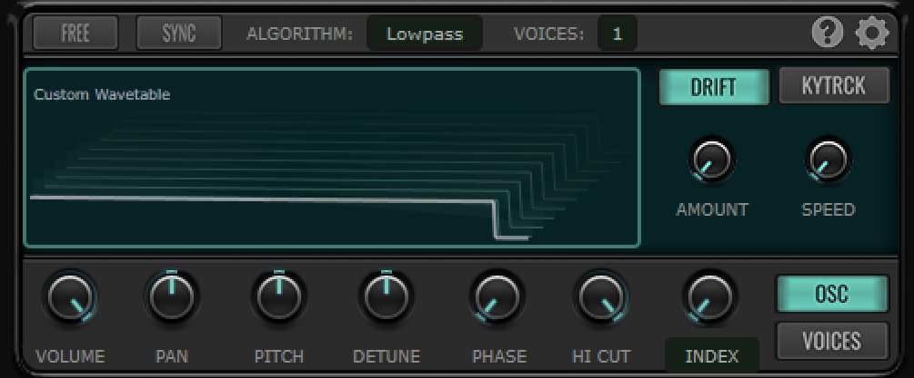

#### Wavetable oscillator

The **Wavetable Oscillator** generates sound by morphing through a series of individual waveforms (frames). Its parameters are divided into standard playback controls and advanced wavetable-specific shaping options.

**Core Wavetable Parameters**

- **Wavetable Index (Position)**: Controls which frame of the wavetable is currently being played. This is the primary parameter for creating movement and can be modulated by the mod wheel, LFOs, or envelopes.
- **Frame Count**: Allows you to adjust the number of frames in a wavetable (from 2 up to 256) for finer control over the sound's evolution.
- **Standard Controls**: Includes dedicated knobs for **Volume**, **Panning**, and **Pitch** (Coarse and Fine/D2).

**Wavetable Editor & Effects**

A major feature of SynthMaster 3 is the built-in Wavetable Editor, which provides seven specific "Wavetable Effects" to sculpt the sound per keyframe:

- **Spectral Filter**: For frequency-based harmonic shaping.
- **Waveshaper**: Adds distortion or saturation to the wavetable frames.
- **Modulator**: Provides additional phase or frequency modulation options.
- **Bender**: Warps the waveform shape within the frame.
- **Shifter**: Shifts the spectral content of the wavetable.
- **LoFi**: Adds bit-crushing or sample-rate reduction effects.
- **Sync**: Emulates classic hard-sync sounds within the wavetable structure.

**Unison & Global Parameters**

Like other oscillators in the modular architecture, the Wavetable Oscillator features expanded unison controls in the **Voices** tab:

- **Voices**: Supports up to **16 unison voices**.
- **Mix Type**: A new parameter to select different pitches, such as **Octaves** or **Chords**, for unison voices.
- **Spread Parameters**: Includes **Pan Spread**, **Detune Spread**, **Phase Spread**, and **Tone Spread**.
- **Drift**: Introduces subtle, randomized pitch variations to simulate analog instability, with controls for **Amount** and **Speed**.
- **Vintage Knob**: Adds per-voice irregularities to simulate the character of vintage hardware.

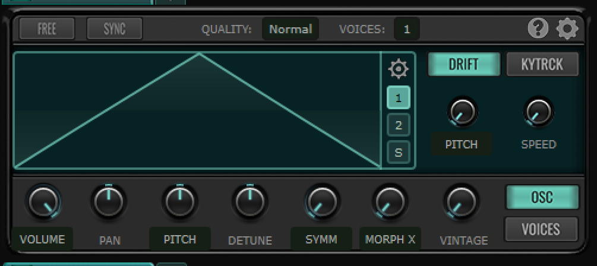

#### VAnalog oscillator

The **VAnalog (Virtual Analog) Oscillator** is a high-resolution generator that renders waveforms in real-time using curve segments to mimic analog circuit behavior. It is distinct from the Basic Oscillator because it allows for continuous morphing between multiple waveform states.

**Morphing & Shaping Controls**

These parameters allow you to evolve the sound by transitioning between different waveform shapes:

- **Symmetry**: Adjusts the balance of the waveform. For example, it can turn a triangle shape into a sawtooth.
- **Morph X**: Morphs between the initial waveform (Shape 1) and the final waveform (Shape 2).
- **Morph Y**: Primarily affects the curves and specific harmonic characteristics of the waveform being rendered.
- **Shape Buttons (1, 2, S)**: Used to select and edit the **Initial (1)**, **Final (2)**, and **Sub (S)** waveforms.
- **Curve Selection**: Accessed via the gear icon, this lets you choose the interpolation or curve type (e.g., second-order step) for the segments.

**Sub Oscillator (S) Parameters**

The VAnalog engine includes a dedicated, independent sub-oscillator:

- **Sub Volume**: Controls the level of the sub waveform in the final mix.
- **Sub Pitch**: Specifically targets the sub waveform’s tuning (often set to -12 for an octave down).
- **Sub Symmetry**: Allows for separate shape adjustment of the sub, such as creating pulse width variations.

**Quality & Drift**

- **Quality Setting**: Adjusts the degree of oversampling (**Low**, **Normal**, **High**, **Best**) to prevent aliasing noise during real-time rendering.
- **Drift Targets**: Unlike basic oscillators, you can apply drift specifically to **Symmetry**, **Morph X**, and **Morph Y** to simulate drifting analog components.

**Voices & Unison**

Available under the **Voices** tab for unison stacks (up to 16 voices):

- **Mix Type**: A new SynthMaster 3 parameter to set unison voices to **Octaves** or **Chords**.
- **Spread Parameters**: Standard spreads for **Volume**, **Pan**, and **Detune**, plus VAnalog-specific spreads for **Symmetry**, **X Morph**, and **Y Morph**.

---

### Filters/Waveshapers

- In each layer you can create up to fifteen (15) filters/waveshaper
- Enable and disable each filter with the LED to the left of the filter/waveshaper tab
- You can add, duplicate and delete filters using the cogwheel next to the filter tabs
- Each filter tab can be renamed by double-clicking the tab text
- You can search for a filter with the magnifying glass icon next to the cogwheel
- Use the left and right arrows next to the magnifying glass to navigate between filter tabs in the list
- The list of filters available are:
  - Digital
  - VAnalog
  - Ladder
  - Diode Ladder
  - State Variable
  - Bite
  - Comb
  - Formant
  - Phaser

#### Digital filter

The **Digital Filter** provides a clean, precise response compared to the character-driven "VAnalog" or "Ladder" models.

While the exact interface layout can vary depending on the chosen filter mode, the Digital Filter typically includes the following core parameters:

**Core Filter Parameters**

- **Filter Mode**: A dropdown menu to select the filter type. Common digital modes include:
  - **Lowpass (LP)**: Cuts high frequencies.
  - **Highpass (HP)**: Cuts low frequencies.
  - **Bandpass (BP)**: Allows only a specific range of frequencies.
  - **Band-Reject/Notch**: Cuts a specific range of frequencies.
- **Cutoff Frequency**: Sets the frequency point where the filter begins to attenuate the signal.
- **Resonance**: Boosts the frequencies around the cutoff point to add "bite" or a whistling quality.
- **Slope**: Selects the steepness of the filter (e.g., 12dB, 24dB, or 48dB per octave). Higher values result in a more aggressive cut.

**Modulation & Tracking**

- **Keytrack (Kytrck)**: Adjusts the cutoff frequency based on the MIDI note played, allowing the filter to "follow" the pitch of the keyboard.
- **Filter Envelope Amount**: Determines how much the assigned envelope (typically an ADSR) modulates the cutoff frequency over time.
- **LFO Amount**: Controls the depth of cutoff modulation from a selected LFO source.

**Output & Character**

- **Volume/Gain**: Adjusts the output level of the filter module to compensate for volume loss at high resonance settings.
- **Pan**: Sets the stereo position of the filtered signal.
- **Mix (Dry/Wet)**: Blends the original unfiltered signal with the filtered version.

#### VAnalog filter

The **VAnalog (Virtual Analog) Filter** in SynthMaster 3 is designed to emulate the warm, non-linear behavior of classic analog hardware. Unlike the "Digital" filter, it includes saturation and "circuit" characteristics.

**Core Filter Controls**

- **Filter Type**: Selects the shape (Lowpass, Highpass, Bandpass, or Band-Reject/Notch).
- **Cutoff**: Sets the frequency where the filter begins to operate.
- **Resonance**: Boosts the signal at the cutoff frequency. At high settings, this filter can **self-oscillate**, behaving like a sine wave oscillator.
- **Slope**: Determines the roll-off steepness (e.g., 12dB or 24dB).

**Analog Character & Drive**

- **Drive/Input Gain**: Adjusts the level of the signal entering the filter. Pushing this adds harmonic saturation and "grit," characteristic of analog circuits.
- **Character/Mode**: Some VAnalog types allow you to choose different circuit emulations (e.g., Moog-style, Roland-style) which change how the resonance and drive interact.
- **Acid**: A specific parameter found in some VAnalog modes that adds "squelch" and resonance emphasizing typical of the TB-303.

**Modulation & Keyboard Settings**

- **Keytrack (Kytrck)**: Adjusts the cutoff frequency based on the MIDI notes played.
  - **Amount**: How much the filter follows the pitch.
  - **Base Note**: The center point for the tracking.
- **Filter Envelope Amount**: Sets the intensity of the envelope's impact on the cutoff.

**Output Options**

- **Volume**: Sets the output level (useful for compensating for volume drops at high resonance).
- **Pan**: Positions the filtered signal in the stereo field.
- **Mix**: A dry/wet knob to blend the original signal with the filtered signal.

#### Ladder filter

The **Ladder Filter** is a high-quality emulation of the classic transistor ladder circuit (famously used in Moog synthesizers). It is known for its warm saturation and the way the volume slightly "dips" as resonance increases.

**Core Filter Controls**

- **Filter Type**: Choose between **Lowpass**, **Highpass**, and **Bandpass** modes.
- **Cutoff**: Sets the frequency where the filter begins to attenuate the signal.
- **Resonance**: Boosts the frequency at the cutoff point. This filter is capable of **self-oscillation** at maximum values.
- **Slope**: Selects the steepness of the curve, typically **12dB** or **24dB** per octave.

**Analog Character & Drive**

- **Drive**: Controls the input gain into the filter circuit. Increasing this adds harmonic distortion and "thickens" the sound before it hits the filter stage.
- **Acid**: A specific parameter that adjusts the resonance characteristic to be more aggressive and "squelchy," similar to classic silver-box basslines.
- **Topology**: Allows you to switch between different internal circuit models (e.g., different versions of the ladder design) which change the "color" of the saturation.

**Modulation & Tracking**

- **Keytrack (Kytrck)**: Links the cutoff frequency to the MIDI notes played.
  - **Amount**: The intensity of the tracking.
  - **Base Note**: The reference note where the tracking begins.
- **Env Amount**: Sets the depth of the dedicated filter envelope's effect on the cutoff.

**Output & Mix**

- **Volume**: Adjusts the final output level of the filter module.
- **Pan**: Sets the stereo position of the filtered signal.
- **Mix**: A dry/wet knob that blends the original sound with the filtered sound.

#### Diode Ladder filter

The **Diode Ladder Filter** in SynthMaster 3 is a specialized emulation of the circuit found in the Roland TB-303. It has a distinct "nasal" and "squelchy" quality compared to the standard transistor ladder filter.

**Core Filter Controls**

- **Filter Type**: Options usually include **Lowpass** (the classic 303 mode) and sometimes **Highpass** or **Bandpass** variations.
- **Cutoff**: Sets the frequency threshold.
- **Resonance**: Boosts the cutoff point. In this model, high resonance creates the iconic "acid" squelch.
- **Slope**: Typically fixed at **18dB/octave** (the signature 303 slope), though some modes allow for **12dB** or **24dB**.

**Drive & Character**

- **Drive**: Controls the input gain. Because diode ladders are non-linear, pushing the drive heavily affects how the resonance "screams" and saturates.
- **Acid**: A dedicated knob that fine-tunes the resonance feedback loop to make it more aggressive and chirpy.
- **Non-Linearity/Limit**: Some versions include a toggle or slider to control how the internal "clipping" of the diodes behaves.

**Modulation & Tracking**

- **Keytrack (Kytrck)**: Links the cutoff frequency to MIDI note pitch.
  - **Amount**: Depth of the tracking.
  - **Base Note**: The center reference key.
- **Env Amount**: Controls how much the filter envelope sweeps the cutoff.

**Output & Mix**

- **Volume**: Sets the final output (diode filters often lose low-end as resonance increases, so this helps compensate).
- **Pan**: Adjusts the stereo position.
- **Mix**: Blends the dry and filtered signals.

#### State variable filter

The **State Variable Filter (SVF)** in [**SynthMaster 3**](https://www.kv331audio.com/synthmaster3.aspx) is highly versatile because it allows for smooth transitioning between different filter shapes (Lowpass, Bandpass, etc.) within a single module.

Here are the primary parameters:

**Mode & Morphing**

- **Filter Mode**: Selects the primary filter type: **Lowpass**, **Highpass**, **Bandpass**, or **Notch**.
- **Morph**: A specialized knob (available in some SVF modes) that allows you to smoothly transition between filter types (e.g., morphing from Lowpass to Bandpass to Highpass).

**Core Filter Controls**

- **Cutoff Frequency**: Sets the frequency threshold where the filter operates.
- **Resonance**: Boosts the frequencies at the cutoff point.
- **Slope**: Sets the roll-off steepness, typically **12dB** or **24dB** per octave.

**Drive & Character**

- **Drive**: Controls the input gain. Increasing this introduces harmonic saturation, making the filter sound "thicker" and more "analog."
- **Character**: Choose between different algorithms like **Analog** (warmer, non-linear) or **Digital** (cleaner, more precise).
- **Acid**: Adds an aggressive, squelchy resonance characteristic to the filter sweep.

**Modulation & Tracking**

- **Keytrack (Kytrck)**: Links the cutoff to the keyboard pitch.
  - **Amount**: Depth of the tracking.
  - **Base Note**: The center key for the tracking effect.
- **Env Amount**: Sets how much the dedicated filter envelope modulates the cutoff.

**Output**

- **Volume**: Adjusts the output level.
- **Pan**: Sets the stereo position.
- **Mix**: A dry/wet knob for parallel filtering.

#### Bite filter

The **Bite Filter** is a character filter designed for aggressive, distorted, and "biting" textures. It combines filtering with internal saturation to create edgy, industrial tones.

**Core Filter Controls**

- **Filter Type**: Options for **Lowpass**, **Highpass**, and **Bandpass**.
- **Cutoff**: Sets the frequency where the filtering and "biting" effect begins.
- **Resonance**: Boosts the signal at the cutoff frequency. In this module, resonance often emphasizes the distortion characteristics.
- **Slope**: Selectable steepness, usually **12dB** or **24dB** per octave.

**Distortion & Character**

- **Bite (Drive)**: The signature parameter for this module. It controls the amount of internal saturation and "grit" applied within the filter circuit.
- **Asymmetry**: Adjusts the distortion's symmetry, allowing you to shift between even and odd harmonics for different tonal "colors."
- **Limit**: Controls how the signal is clipped or limited when the Bite/Drive is pushed to extremes.

**Modulation & Tracking**

- **Keytrack (Kytrck)**: Links the cutoff to your keyboard pitch.
  - **Amount**: The intensity of the tracking.
  - **Base Note**: The reference pitch for the tracking.
- **Env Amount**: Determines how much the filter envelope sweeps the cutoff frequency.

**Output & Mix**

- **Volume**: Sets the final output level (crucial for managing the gain increase from the Bite parameter).
- **Pan**: Adjusts the stereo position of the filtered signal.
- **Mix**: A dry/wet knob to blend the aggressive filtered sound with the clean input.

#### Comb filter

The **Comb Filter** is an improved version of the digital comb filter from previous iterations, now integrated into the modular architecture for deeper sound design. It works by adding a delayed version of the signal to itself, creating harmonically related peaks and valleys in the frequency spectrum.

The primary parameters available for the Comb Filter include:

**Operating Modes & Feedback**

- **Mode**: Selects between **Feedback** and **Feedforward** operation.
  - **Feedback** mode creates more resonant, "ringing" textures often used for Karplus-Strong string synthesis.
  - **Feedforward** mode typically creates more subtle flanging or "hollow" textures.
- **Delay Time / Cutoff**: Sets the time delay between the original and processed signals. Because the frequency of the "teeth" in the comb is determined by the inverse of the delay time, this effectively acts as the "tuning" or frequency control of the filter.
- **Feedback Amount**: Controls how much of the output is fed back into the input, determining the intensity and resonance of the "comb" effect.

**Damping & Internal Filtering**

A major improvement in SynthMaster 3 is the addition of damping filters within the feedback loop to control the decay of specific frequencies:

- **Damping Mode**: Selectable modes for the feedback loop, including:
  - **Highpass / High Shelve**
  - **Lowpass / Low Shelve**
- **Damping Frequency**: Sets the cutoff point for the internal damping filter to darken or brighten the resonant "tail".

**Global & Modulation Parameters**

- **Mix (Dry/Wet)**: Blends the original signal with the comb-filtered output.
- **Volume & Pan**: Standard controls for the module's output level and stereo position.
- **Modulation**: Like all modules in SynthMaster 3, these parameters can be targeted by up to 32 modulation sources per layer, such as **LFOs** or **Envelopes**, to create evolving "sweeping" flanger effects.

#### Formant filter

The **Formant Filter** is a new polyphonic effect module that uses a parallel bank of filters to emulate the resonant characteristics of the human vocal tract. Its primary parameters focus on selecting specific vocal shapes and morphing between them:

**Core Formant Controls**

- **Vowel Selection**: Allows you to choose specific vowel sounds (e.g., "A", "E", "I", "O", "U") for different slots.
- **Vowel Morph**: A central parameter that smoothly transitions between the selected initial and final vowel shapes, creating "talking" or sweeping vocal effects.
- **Resonance**: Adjusts the sharpness of the parallel filter peaks, which increases the "vocal" intensity of the effect.
- **Cutoff / Frequency**: Often acts as a global shift for all formant peaks, allowing you to change the "size" or pitch characteristic of the perceived voice.

**Modulation & Tracking**

- **Keytrack (Kytrck)**: Determines how the resonant peaks shift based on the MIDI notes played. High tracking (100%) moves the formants with the pitch, while lower values keep the "vocal" character more stable across the keyboard.
- **Smooth**: Controls the rate at which the filter transitions between vowel shapes, preventing abrupt or "clicking" jumps during fast modulation.

**Standard Output Parameters**

- **Drive**: Controls the input gain into the filter, adding harmonic saturation that can make the vowel sounds more prominent.
- **Mix (Dry/Wet)**: Blends the processed vocal-like signal with the original dry input.
- **Volume & Pan**: Standard controls for adjusting the module's final output level and stereo position.

#### Phaser filter

The **Phaser Filter** is a polyphonic module that operates per voice, providing more detailed control than a global phaser effect. It creates its characteristic sound using multiple allpass filters mixed with the original input. The primary parameters for the Phaser Filter include:

**Core Modulation & Control**

- **Rate/Speed**: Controls the frequency of the internal LFO that sweeps the phaser's notches.
- **Phase**: Adjusts the center point of the allpass filter stages, effectively setting the "position" of the phasing effect in the frequency spectrum.
- **Resonance/Feedback**: Feeds the output back into the input to create more pronounced, sharper peaks and a more intense "swirling" tone.
- **Stages**: Sets the number of allpass filter stages used (e.g., 2, 4, 8, etc.). More stages result in more notches and a more complex sound.

**Stereo & Voice Parameters**

- **LFO Spread/Phase**: Offsets the LFO for the left and right channels to create stereo width and motion.
- **Depth**: Determines the range of the sweep applied to the allpass filters.
- **Mix (Dry/Wet)**: Blends the processed signal with the original. The deepest notches are typically achieved at a **50% mix**.

**Global Module Parameters**

- **Volume**: Adjusts the final output level of the filter module.
- **Pan**: Sets the stereo position of the output signal.
- **Bypass**: Quickly toggles the module on or off within the layer's routing.

#### Waveshaper

The **Waveshaper** is a distortion and waveshaping module that transforms the input signal's amplitude based on a transfer function. In version 3, this module is highly flexible, allowing you to choose between preset algorithms or draw your own custom mapping.

Here are the primary parameters:

**Core Shaping Controls**

- **Type/Algorithm**: Selects the mathematical function used for distortion. Options include:
  - **Soft / Hard Clipping**: Standard saturation and square-wave style clipping.
  - **Tanh / Sine**: Smoother, more musical saturation curves.
  - **Asymmetric**: Distorts the positive and negative peaks of the waveform differently, adding even harmonics.
  - **Custom**: Allows you to use the built-in graph editor to draw your own distortion curve.
- **Drive**: Controls the input gain into the waveshaper. Pushing this increases the amount of distortion and harmonic saturation.
- **Offset**: Shifts the input signal's DC bias before it hits the shaping curve, which significantly changes the character of asymmetric distortion.

**Graph Editor (Custom Mode)**

- **Points/Nodes**: You can add, remove, or move points on the 2D graph to create complex, non-linear distortion curves.
- **Curve Type**: Sets the interpolation between points (e.g., linear, curved, or stepped).

**Pre/Post Filtering & Global**

- **Input Filter (High/Low Cut)**: Many modes include simple filtering to clean up the signal before it is distorted, helping to avoid harsh "fizz."
- **Output Gain (Volume)**: Compensates for the significant volume increase that usually occurs when applying heavy Drive.
- **Mix (Dry/Wet)**: Blends the distorted signal with the clean input, which is essential for "parallel distortion" to keep the original sound's punch.
- **Pan**: Sets the stereo position of the processed signal.

#### Operator (appears broken)

### Modulation

- In each layer you can create up to twenty-four (24) modulation units
- Enable and disable each modulation unit with the LED to the left of the modulation tab
- You can drag and drop a modulation tab (indicated by crossed arrows) to any applicable parameter on the interface
- You can easily inspect modulation sources and targets, with visual feedback (highlighted rings) on knobs indicating active modulation
- You can add, duplicate and delete modulation using the cogwheel next to the modulation tabs
- Each modulation tab can be renamed by double-clicking the tab text
- You can search for a modulation tab with the magnifying glass icon next to the cogwheel
- Use the left and right arrows next to the magnifying glass to navigate between modulation tabs in the list
- There are six types of modulation sources:
  - **ADSR Envelopes,** The fundamental envelope for controlling parameters like volume and filter cutoff, with options for digital, analog-modeled, and one-shot behaviors.
  - **Multistage Envelopes,** Offers more complex, multi-segment curves with looping capabilities and sync-to-tempo features for intricate sound shaping.
  - **LFO (Low Frequency Oscillators),** Oscillators that run at block rates, used for periodic modulation. They include noise and sample-and-hold options, envelope control, and poly/mono trigger modes.
  - **Noise LFO,** A specialized source for generating fluctuating, noise-based modulation, featuring different noise colors (white, brown, violet) and bit-reduction options.
  - **Step LFO,** A rhythmic sequencer-style modulation source where each step can have a fixed length, gate, and specific slope, allowing for complex, tempo-synced rhythmic effects.
  - **Scaler,** A unique tool that re-maps input modulation sources (like key tracking or other LFOs) through a custom curve, allowing for advanced wave shaping and modulation distortion.

#### ADSR Envelope Parameters

- **Attack, Decay, Release (ADR):** Times can range from milliseconds to seconds, with adjustable slopes.
- **Sustain Level:** Determines the level held while a key is pressed.
- **Envelope Amount:** Controls the overall depth or intensity of the modulation applied to destinations.
- **Envelope Lag:** Acts as a low-pass filter to smooth the envelope's output, reducing sharp changes.
- **Mode:** Normal or one-shot, allowing the envelope to play fully regardless of key release.
- **Tempo Sync:** Envelope times can be synchronized to the project tempo.

#### Multistage Envelope Parameters

- **Advanced Shaping:** Allows for custom-drawn curves for complex modulation shapes.
- **Looping/Stages:** Multiple nodes for complex, non-standard envelope shapes.
- **Lock Length:** A feature that allows moving envelope points without changing the total time duration.
- **Magnifier:** A tool to expand the view for precise adjustments.

#### LFO (Low Frequency Oscillators) parameters

- **Speed/Rate:** Controls how fast the LFO oscillates, from 0.01 Hz up to 100 Hz, with options to synchronize to project tempo (e.g., note, triplets).
- **Waveform/Shape:** Users can select standard waveforms or draw custom shapes in the editor.
- **Amplitude/Volume:** Adjusts the amount of modulation applied, with noise able to be imposed on top of shapes.
- **Phase:** Dictates the starting point within the waveform cycle.
- **Bipolar/Unipolar:** Determines if the output swings both above and below zero (bipolar, e.g., -1 to +1) or only from zero upwards (unipolar, e.g., 0 to +1).
- **Delay/Attack/Release:** A 2-stage envelope controls how the LFO modulation intensity fades in or out over time.
- **Sample and Hold (S&H):** Reduces the LFO's resolution, creating stepped modulation, often combined with noise.
- **Trigger Modes:** Determines how the modulation is triggered, such as polyphonic (per-voice) or random.

#### Noise LFO

The Noise LFO generates sample-and-hold noise to create erratic or randomized modulation, such as for filter cutoffs or pitch**. It generates various noise types (white, pink, brown, violet, blue), which can be sampled, held, bit-reduced, and passed through an attack/decay envelope follower.

- **Noise Type Selection:** Allows selection between white, pink, brown, violet, or blue noise.
- **Speed/Rate:** Controls how fast the LFO operates (0.01 Hz to 100 Hz), with an option to sync to the song tempo.
- **Sample and Hold (S&H):** Reduces the LFO resolution to create stepped, random modulation.
- **Attack/Decay Envelope:** Follows the Noise LFO to shape the modulation over time.
- **Tone:** A low-pass filter to soften the edges of the noise waveform.
- **Phase:** Determines the starting point of the waveform cycle.
- **Amount/Volume:** Controls the intensity of the modulation, with the ability to add noise on top of standard LFO shapes.
- **Trigger:** Defines how the modulation is initiated, such as polyphonic (per voice) or with a random phase.

#### Step LFO

Step LFO, within the modulation section, allows for creating rhythmic, looping patterns with customizable steps (up to 32), speed (0.01Hz–100Hz or BPM sync), and shape modulation. Key parameters include **step drawing, step divisions, crossfade between shapes, lag, random, and looping controls**, offering detailed control over rhythmic modulation

- **Step Count:** The number of steps can be increased from the default 8 up to a maximum of 32.
- **Step Editing & Shapes:** Users can draw custom shapes by dragging steps up or down, including a magnifying glass for detailed editing.
- **Speed/Sync:** Adjusts speed from 0.01 Hz to 100 Hz, with tempo-synced options (e.g., eighth notes).
- **Step Divisions:** Hovering over a step allows setting division values (e.g., , ), causing that step to repeat within its duration.
- **Loop Controls:** Features loop start/end points to create specific, repeating rhythmic patterns.

    

- **Crossfade/Mode:** Blends between two distinct LFO patterns, with selectable single or double modes.
- **Lag & Gate:** The "Lag" parameter smooths transitions between steps, while "Gate" controls the LFO waveform gating.
- **Random:** A knob that introduces random values into the LFO pattern.
- **Phase:** Sets the starting point of the LFO waveform.
- **Noise/Tone:** Adds noise to the shape and includes a low-pass filter (Tone) to round off shapes.
- **Attack/Release:** A two-stage envelope to control the LFO's modulation amount over time.
- **Trigger Modes:** Includes options like polyphonic or random starting phases.

#### Scaler

The **Scaler** (formerly known as Keyscaler in SynthMaster 2) is a dedicated modulation source module that allows for the creation of custom shapes and curves to modulate parameters. It is designed to act as a complex waveshaper for another modulation input.

The specific scalar parameters and controls within the Scaler modulation section include:

- **Input Source Selection:** The ability to choose a source (e.g., Keytrack) to act as the input to the scaler.
- **Custom Curve Editor:** A graphical editor for creating custom mapping shapes, which can act as a wavetable or custom function.
- **Unipolar/Bipolar Mode:** Determines if the scalar output acts as a positive-only (unipolar) or positive/negative (bipolar) modulation source.
- **Influence Source:** A key feature where another modulation source can affect the behavior of the scaler itself.
- **Graph Points/Interpolation:** Parameters to define the shape, often including different interpolation types (linear, curve, step) for the curve segments.

### Layer tab

In SynthMaster 3, the Layer Tab (part of the 4-quadrant layout) provides comprehensive control over each of the 16 available layers, allowing users to define how a layer behaves in terms of voice management, keyboard/velocity mapping, and MIDI input. It is focused on **layer-specific general parameters** rather than individual module editing.

Key properties and parameters within the Layer Tab section include:

- **Voices/Voice Mode:** Sets the layer to be polyphonic or monophonic.
- **Voice Stealing Modes:** Determines which voice is stolen when the max voice count is exceeded, including options like "released voices first," "last note priority," or "high note priority".
- **Glide:** Determines the time it takes to switch between pitches for monophonic sounds.
- **Mono Trigger Modes:** Defines how envelopes are triggered in mono mode (e.g., Re-trigger, Resume, Legato).
- **Keyboard Zone:** Defines the MIDI note range (lowest to highest note) within which the layer will play.
- **Velocity Zone:** Defines the MIDI velocity range (minimum to maximum velocity) at which the layer will produce sound.
- **MIDI Input Channel:** By default, layers accept input from all channels (Omni), but a specific MIDI channel can be assigned to a layer.
- **MIDI Output Channel:** Allows routing of MIDI generated by the layer's Arpeggiator or Sequencer to different tracks in a DAW.
- **Layer Gain/Volume:** Controls the overall volume of the layer.
- **Layer Pan:** Controls the stereo panning of the layer's final output.

### Routing

The Routing Tab in SynthMaster 3 serves as the central hub for managing the signal flow within each layer, providing a visual representation of the modular architecture. It allows users to manage up to 16 modules (generators, filters, and effect modules) per layer.

Key properties and functions within the Routing Tab include:

- **Module Addition & Removal:** Users can add new modules, remove existing ones, or duplicate them to build complex patches.
- **Module Management:** The tab allows for bypassing or activating specific modules and replacing them with others in the signal path.
- **Modular Connections:** Users can create or remove connections between generator modules (oscillators, modulators) and effect modules (filters, waveshapers).
- **Visual Signal Flow:** Provides a clear view of how audio travels from oscillators through filters and effects within the layer.
- **Layer Structure Management:** The Routing tab is part of a larger, deep semi-modular engine that supports up to 16 layers per instance, each with up to 32 modulation sources.

**Available Module Types and Design:**

- **Generator Modules:** Includes Basic, Additive, Vector, Wavetable, VAnalog, and Granular Oscillators, plus Modulators.
- **Effect Modules:** Features a wide range of options, including Digital, VAnalog, State Variable, Ladder, Diode Ladder, Bite, Comb, Phaser, Formant Filters, and Waveshapers.

### Layer FX Tab

The Layer FX tab section allows for detailed, independent processing of each of the 16 available layers, with up to **6 insert effect slots** per layer. These effects are accessible via the **Mix View** or individual **Layer Views** and provide modulation capabilities for every parameter.

The properties and available effect modules within this section include:

#### 1. Insert Effect Modules (Per-Layer)

SynthMaster 3 features a variety of insert effects that can be added to any of the 6 slots per layer:

- **Filterbank:** Various lowpass, highpass and bandpass available.
- **Distortion/Waveshaper:** The new Waveshaper effect offers multiple algorithms, including Soft Tanh, Soft ATan, Heavy, Fuzz, Fold Sine, Fold Tri, Fold Round, Rectify Full, Rectify Half, Clip, and Bitcrush.
- **Time-Based & Modulation:** Chorus, Delay, Reverb, Ensemble, Phaser, and Tremolo are available.
- **Dynamics & Utility:** Compressor, EQ, LoFi, and Vocoder modules are included.

#### 2. Layer FX Controls

Within the layer FX section, users can manage the following:

- **6 Insert Slots:** Up to six individual effects can be inserted per layer.
- **Routing/Ordering:** Effects can be reordered via drag-and-drop to change the signal flow.
- **Bypass/Toggle:** Each effect module can be toggled on or off.

### SEQ Tab

The SEQ (Sequencer) tab section in SynthMaster 3 provides a per-layer, 32-step sequencer designed for creating complex patterns, melodies, and rhythmic sequences. It is part of the expanded modulation and sequencing engine, which allows for detailed editing of note data, timing, and modulation.

**Key Properties and Functions within the SEQ Tab:**

- **Step Editing:** Features a large editing window to draw, add, or remove steps.
- **Step Properties:** Individual notes can be edited for:
  - **Pitch/Note Value:** Adjusted using a mouse scroll wheel.
  - **Velocity:** Individual step velocities can be edited, allowing for organic, non-uniform performances.
  - **Gate Time/Length:** Note lengths can be changed for each step, and gate amounts can be modulated, for instance, by the mod wheel.
- **Step Recording:** Includes a record button for inputting notes in real-time.
- **Step Length and Time:** Step length can vary from one to eight, or utilize fractional steps (1/2, 1/3, 1/4).
- **Velocity Modes:** Step velocity can be configured to use direct MIDI velocity, note velocity, step + note velocity, or step times note velocity.
- **Modulation Target:** Step velocity can act as a modulation source to control parameters such as the filter cutoff.
- **Randomization:** Features for randomizing steps, including volume, gate, and trigger probability.
- **MIDI Import/Export:** Supports the import of quantized, non-polyphonic MIDI files.
- **MIDI Out:** The sequencer can send generated MIDI out of the VST plugin to other tracks in a DAW, with specific MIDI output channels for each layer.
- **Zoom Functionality:** Allows zooming in to see the sequence in greater detail.

**Workflow Functionality:**

- **Separate Per Layer:** Each of the 16 possible layers in a preset has its own separate sequencer.
- **Arp Integration:** The output of the sequencer can be fed through the arpeggiator for further manipulation.
- **Track View:** The sequencer parameters can be viewed and edited in the Track View for multiple layers simultaneously.

### Arp tab

The Arpeggiator (ARP) tab in SynthMaster 3 is a dedicated section within each of the 16 available layers, featuring a comprehensive step sequencer and arpeggiator that allows for complex, independent note generation.

Key properties and features within the ARP tab include:

- **Step Sequencing and Arp Combo:** The MIDI input signal passes through a 32-step sequencer before reaching the arpeggiator.
- **Step Parameters:** Each step in the sequence can have independent values for:
  - **Trigger:** Whether the step triggers a note.
  - **Hold:** How long the note is held.
  - **Slide/Glide:** Defines gliding between notes.
  - **Velocity:** Individual velocity adjustment per step.
- **Arp/Sequencer Randomization:** Each step can be randomized regarding trigger, hold, and slide parameters.
- **Arpeggiator Modes:** Standard and advanced arpeggiator modes (e.g., Up, Down, UpDown, etc.).
- **Step Length Control:** Step lengths can vary, with options ranging from 1/8 to 1/2, 1/3, or 1/4.
- **Gate/Vel/Velocity Modes:** The step volume can be adjusted to change output velocity, with options to use raw MIDI velocity, step velocity, or a combination of both.
- **MIDI Output:** Each layer has its own MIDI output channel, allowing users to route the generated arpeggiator/sequencer patterns to different tracks in their DAW.
- **Editor Functionality:** The sequencer has a large, zoomable edit window where notes can be changed using the mouse wheel, and chords can be recorded.
- **MIDI File Import:** The sequencer supports importing quantized, non-polyphonic MIDI files.
- **Individual Layer Control:** Because the ARP is part of the modular layer system, arpeggiators can be toggled on/off, and edited independently for each of the 16 layers.

## Track view in-depth

The Track View in SynthMaster 3 is designed for managing and editing parameters across multiple layers (up to 16) simultaneously in a horizontal list format. It is particularly useful for finalizing multi-layered performance patches or groovebox arrangements.

Key properties and parameters editable within the Track View include:

- **Layer Management:** Ability to mute or solo individual layers.
- **Zones:** Adjustment of keyboard zones (key range) and velocity zones (velocity range) to determine when each layer plays.
- **Voicing/Unison:** Control over unison settings, including unison voices, spread, and mix types (octaves/chords).
- **Arpeggiator & Sequencer:** Parameters for individual layer arpeggiators and step sequencers, which can be edited with zoom functionality.
- **Global Controls:** The Track View allows for turning layer-specific sequencers and arpeggiators on or off.
- **Parallel Editing:** Users can shift-click buttons to edit parameters of multiple layers at once.

The Track View facilitates editing similar parts of up to 4 layers at a time side-by-side.

## Mix view in-depth

In SynthMaster 3, the **Mix View** provides a mixing-console style interface designed for managing up to 16 layers and applying global effects. It is specifically used for editing insert FX and FX send parameters for multiple layers simultaneously.

Key properties and features within the Mix View include:

- **Layer Channel Strips:** Layers are displayed as vertical lists (channel strips), allowing for quick, parallel mixing.
- **Insert FX Slots:** Each layer has dedicated slots (up to 6 per layer) for insert effects such as Chorus, Compressor, Delay, Distortion, EQ, Ensemble, FilterBank, LoFi, Phaser, Reverb, Tremolo, and Vocoder.
- **Layer Effects Toggling & Editing:** Individual layer effects can be toggled on/off, and detailed parameters can be accessed via a zoom button.
- **FX Sends:** Adjustable send amounts for sending layer output to two global parallel effect buses (typically Delay and Reverb).
- **Global FX Buses:** Access to master parallel effects buses, including equalizer, delay, and reverb.
- **Volume & Pan:** Basic mixing controls for each layer's volume and pan.
- **Solo and Mute:** Dedicated solo and mute buttons for each layer for easy programming.
- **Effect Reordering:** The ability to drag and drop to reorder insert effects within a layer.

## Keyboard and interface settings in-depth

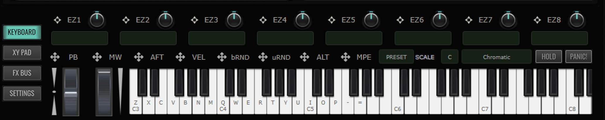

### Keyboard

- Shows EZ macros, which allow drag and drop to various parameters per macro to control various things at once, with adjustable Macro name.
- Also draggable are keyboard adjustments such as pitch bend, mod wheel and aftertouch which can be used to adjust parameters.
- Global/preset MIDI learn
- Ability to set scale and type
- Hold keeps the note pressed by MIDI or the virtual keyboard continuous
- Panic button stops all MIDI notes

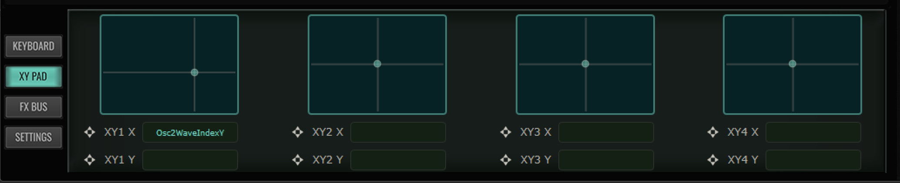

### XY Pad

- Drag and drop XY pad (shown via crossed arrow icons) on parameters that can be manipulated manually using the pad on both X and Y axis; can be used across layers (globally). It cannot be modulated with LFOs and envelopes.

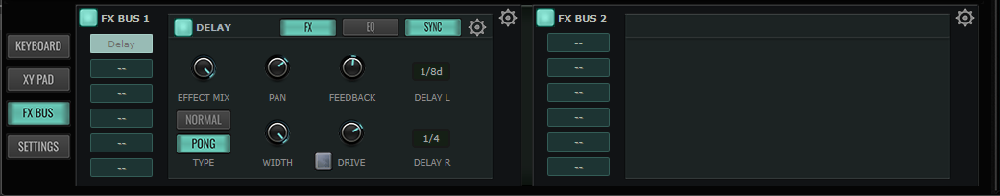

### FX Bus

SynthMaster 3 includes global parallel effect buses—specifically for delay and reverb—accessible via the **Mix View and Layer view.**

- **Send Amounts:** Each of the 16 layers can independently send its output to these global buses with adjustable send amounts.
- **Macro Controls:** The send amounts can be modulated, potentially controlled by macro controls.
- **Equalizer:** The global bus includes an equalizer.
- Each global FX bus send can have 6 insert effects, which can be reordered by dragging and dropping.
- **Available Effects:** Chorus, Compressor, Delay, Distortion, EQ, Ensemble, Filterbank, LoFi, Phaser, Reverb, Tremolo, and Vocoder. These effects cannot be modulated since they are Global

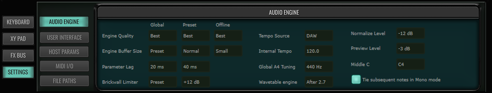

### Settings

- Audio engine
  - Adjust engine quality from Draft to Best, engine buffer size, parameter lag, brick wall limiter, and other options
- User interface
  - Enable/disable real time animations, change author name, option to check for updates, enable QWERTY keyboard for MIDI-free playing, turn on tooltips, etc.
- Host params
  - Shows list of macros and XY pads available
- MIDI I/O
  - Modify the behavior of how the plugin responds to MIDI in/out
- File Paths
  - View and add file paths to presets, waveforms, samples from your computer

